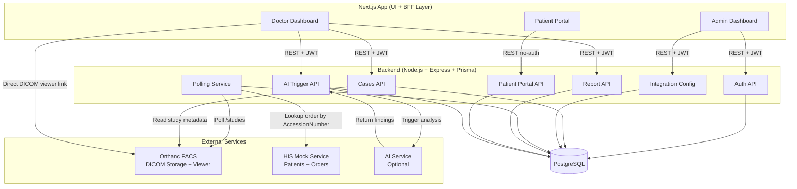

# Radiora — System Architecture

## Overview

Radiora is composed of five distinct services. Each has a clearly scoped responsibility. The **Backend** is the single source of truth and the only service that communicates with all others.

---

## Services

### 1. Backend (Core Orchestrator)
- **Runtime:** Node.js + Express
- **ORM:** Prisma
- **DB:** PostgreSQL
- **Role:** Master controller. Handles auth, case lifecycle, integration config, polling, report management, and patient portal.
- **Key behaviors:**
  - Polls Orthanc for new DICOM studies at a configured interval
  - Queries the HIS to match study AccessionNumbers to patient orders
  - Creates cases in the database when a match is found
  - Routes AI analysis requests and attaches results to cases
  - Exposes all APIs consumed by the frontend

### 2. HIS Service (Mock)
- **Runtime:** Node.js + Express (separate microservice)
- **DB:** In-memory or lightweight SQLite
- **Role:** Simulates a Hospital Information System. Holds patient demographics and imaging orders only.
- **Exposes:**
  - `GET /patients/:id` — patient lookup
  - `GET /orders?accessionNumber=` — order lookup by AccessionNumber
  - `POST /patients` — register a patient
  - `POST /orders` — create an imaging order

### 3. PACS — Orthanc
- **Type:** External service (not built by us)
- **Protocol:** DICOM + REST API (Orthanc REST API)
- **Role:** Stores all DICOM studies (CT, MRI, X-Ray). Provides a web-based DICOM viewer (Stone of Orthanc / OHIF).
- **Interaction with Backend:**
  - Backend polls `GET /studies` to detect new studies
  - Backend reads study metadata (`GET /studies/:uid`) to extract AccessionNumber, PatientID, modality, date
  - Backend does not manage or store imaging data. It may forward uploaded files to Orthanc, but Orthanc remains the source of truth for all imaging data.

### 4. Frontend — Next.js Application
- **Runtime:** Next.js (React framework)
- **Role:** Dual-purpose — UI layer and thin backend-for-frontend (BFF)
- **Auth:** JWT stored in HTTP-only cookie or memory; sent as `Authorization: Bearer <token>` header on API calls

**As a UI Layer**, Next.js renders three dashboards:

- **Admin Dashboard:** Integration setup, doctor management, case monitoring and assignment
- **Doctor Dashboard:** Case inbox, PACS viewer redirection, report submission, AI result display
- **Patient Portal:** Read-only report access via secure token link

**As a BFF Layer**, Next.js may use API routes or Server Actions for:
- Session handling and token management
- Minor data formatting or aggregation before rendering
- Proxying backend requests if direct CORS calls are not suitable

**What Next.js must NOT do:**
- No PACS polling or Orthanc communication
- No HIS integration logic
- No case creation or AI orchestration
- No core business logic of any kind

All of the above belong strictly to the backend.

### 5. AI Service (Optional)
- **Role:** Async analysis layer. Accepts a `studyInstanceUID`, fetches the study from Orthanc directly, runs inference, and returns a structured result to the backend.
- **Integration:** Backend calls AI service via REST. AI service responds with findings (JSON). Backend attaches findings to the case record.
- **Constraint:** System operates fully without this service. AI is only invoked if the admin has enabled it and a case is flagged for analysis.

---

## Communication Flow

| From | To | Protocol | Purpose |
|---|---|---|---|
| Frontend | Backend | REST/HTTP + JWT | All user actions |
| Backend | HIS | REST/HTTP | Patient + order lookup |
| Backend | Orthanc | REST/HTTP | Study polling + metadata fetch |
| Backend | AI Service | REST/HTTP | Trigger analysis, receive result |
| Frontend | Orthanc | Browser redirect (URL) | DICOM viewer access (no image proxying) |
| Patient | Backend | REST/HTTP | Report access (no auth) |

---

## Architecture Diagram

---

## Deployment Topology

For the hackathon, all services run locally or in Docker containers on the same machine:

| Service | Port |
|---|---|
| Backend | `3000` |
| HIS Mock | `3001` |
| Orthanc | `8042` |
| Frontend | `3002` (Next.js dev server) |
| AI Service | `5000` |
| PostgreSQL | `5432` |
