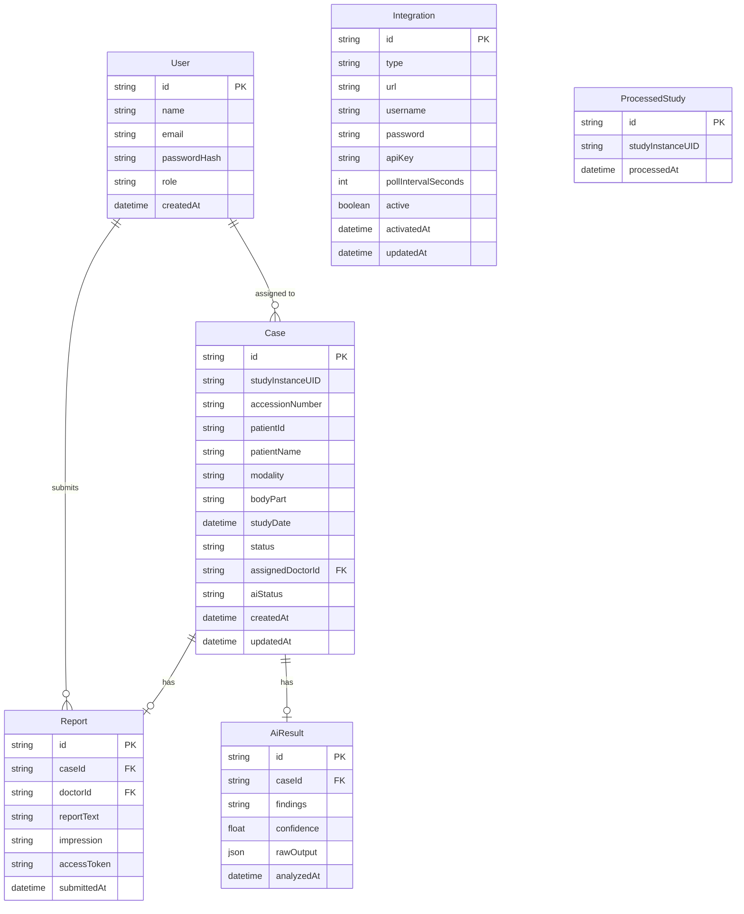

# Radiora — Database Schema

All data is stored in PostgreSQL and accessed via Prisma ORM. The schema is designed to be minimal — it stores only references to PACS data (via `studyInstanceUID`), never the images themselves.

---

## Tables

### `User`
Stores admin and doctor accounts.

| Column | Type | Description |
|---|---|---|
| `id` | `String` (cuid) | Primary key |
| `name` | `String` | Full name |
| `email` | `String` | Unique; used for login |
| `passwordHash` | `String` | bcrypt-hashed password |
| `role` | `Enum(ADMIN, DOCTOR)` | Access level |
| `createdAt` | `DateTime` | Registration timestamp |

---

### `Integration`
Stores PACS and HIS configuration set by the admin. One row per integration type.

| Column | Type | Description |
|---|---|---|
| `id` | `String` (cuid) | Primary key |
| `type` | `Enum(PACS, HIS)` | Integration type |
| `url` | `String` | Base URL of the external service |
| `username` | `String?` | Optional credential (PACS basic auth) |
| `password` | `String?` | Optional credential |
| `apiKey` | `String?` | Optional API key (HIS) |
| `pollIntervalSeconds` | `Int?` | Polling interval for PACS |
| `active` | `Boolean` | Whether integration is currently active |
| `activatedAt` | `DateTime?` | Timestamp when integration was last activated |
| `updatedAt` | `DateTime` | Last modified timestamp |

---

### `Case`
Central entity. Represents a matched study + patient order combination.

| Column | Type | Description |
|---|---|---|
| `id` | `String` (cuid) | Primary key |
| `studyInstanceUID` | `String` | Unique; DICOM Study UID from Orthanc |
| `accessionNumber` | `String` | From HIS order; used to correlate |
| `patientId` | `String` | From HIS patient record |
| `patientName` | `String` | Cached from HIS at case creation time |
| `modality` | `String` | CT, MRI, X-Ray, etc. |
| `bodyPart` | `String?` | Cached from HIS order |
| `studyDate` | `DateTime?` | Date of scan from DICOM metadata |
| `status` | `Enum` | See statuses below |
| `assignedDoctorId` | `String?` | FK → `User.id` |
| `aiStatus` | `Enum(AiStatus)` | AI analysis lifecycle state; defaults to `NOT_REQUESTED` |
| `createdAt` | `DateTime` | When the case was created |
| `updatedAt` | `DateTime` | Last updated |

**Case Statuses:**

| Status | Meaning |
|---|---|
| `UNASSIGNED` | Case created, no doctor assigned yet |
| `PENDING_REVIEW` | Doctor assigned, awaiting review |
| `IN_REVIEW` | Doctor has opened the case |
| `COMPLETED` | Report submitted |

**AI Status Values:**

| Value | Meaning |
|---|---|
| `NOT_REQUESTED` | AI analysis has not been triggered |
| `PROCESSING` | AI service has been called; awaiting result |
| `COMPLETED` | AI result received and stored in `AiResult` |
| `FAILED` | AI service returned an error or timed out |

---

### `Report`
Stores the submitted radiology report. One report per case.

| Column | Type | Description |
|---|---|---|
| `id` | `String` (cuid) | Primary key |
| `caseId` | `String` | FK → `Case.id` (unique) |
| `doctorId` | `String` | FK → `User.id` |
| `reportText` | `String` | Full report narrative |
| `impression` | `String?` | Summary conclusion |
| `accessToken` | `String` | Unique token used for secure patient report access |
| `submittedAt` | `DateTime` | Submission timestamp |

---

### `AiResult`
Stores the AI analysis result for a case. Optional; one result per case.

| Column | Type | Description |
|---|---|---|
| `id` | `String` (cuid) | Primary key |
| `caseId` | `String` | FK → `Case.id` (unique) |
| `findings` | `String` | AI-generated findings text |
| `confidence` | `Float?` | Confidence score (0.0 – 1.0) |
| `rawOutput` | `Json?` | Full AI response payload |
| `analyzedAt` | `DateTime` | When analysis completed |

---

### `ProcessedStudy`
Deduplication table. Tracks every `studyInstanceUID` the polling service has already created a case for.

| Column | Type | Description |
|---|---|---|
| `id` | `String` (cuid) | Primary key |
| `studyInstanceUID` | `String` | Unique; the processed UID |
| `processedAt` | `DateTime` | When the study was first seen and processed |

---

## Relationships

```
User (DOCTOR) ──< Case (via assignedDoctorId)
Case ──── Report (1:1)
Case ──── AiResult (1:1, optional)
ProcessedStudy (standalone ledger — no FK to Case)
Integration (one row per type: PACS or HIS)
```

---

## ER Diagram



---

## Prisma Schema Reference

```prisma
enum Role {
  ADMIN
  DOCTOR
}

enum CaseStatus {
  UNASSIGNED
  PENDING_REVIEW
  IN_REVIEW
  COMPLETED
}

enum AiStatus {
  NOT_REQUESTED
  PROCESSING
  COMPLETED
  FAILED
}

enum IntegrationType {
  PACS
  HIS
}

model User {
  id           String   @id @default(cuid())
  name         String
  email        String   @unique
  passwordHash String
  role         Role     @default(DOCTOR)
  createdAt    DateTime @default(now())
  cases        Case[]
  reports      Report[]
}

model Integration {
  id                  String          @id @default(cuid())
  type                IntegrationType @unique
  url                 String
  username            String?
  password            String?
  apiKey              String?
  pollIntervalSeconds Int?
  active              Boolean         @default(false)
  activatedAt         DateTime?
  updatedAt           DateTime        @updatedAt
}

model Case {
  id               String     @id @default(cuid())
  studyInstanceUID String     @unique
  accessionNumber  String
  patientId        String
  patientName      String
  modality         String
  bodyPart         String?
  studyDate        DateTime?
  status           CaseStatus @default(UNASSIGNED)
  assignedDoctorId String?
  aiStatus         AiStatus   @default(NOT_REQUESTED)
  createdAt        DateTime   @default(now())
  updatedAt        DateTime   @updatedAt
  assignedDoctor   User?      @relation(fields: [assignedDoctorId], references: [id])
  report           Report?
  aiResult         AiResult?
}

model Report {
  id          String   @id @default(cuid())
  caseId      String   @unique
  doctorId    String
  reportText  String
  impression  String?
  accessToken String   @unique
  submittedAt DateTime @default(now())
  case        Case     @relation(fields: [caseId], references: [id])
  doctor      User     @relation(fields: [doctorId], references: [id])
}

model AiResult {
  id         String   @id @default(cuid())
  caseId     String   @unique
  findings   String
  confidence Float?
  rawOutput  Json?
  analyzedAt DateTime @default(now())
  case       Case     @relation(fields: [caseId], references: [id])
}

model ProcessedStudy {
  id               String   @id @default(cuid())
  studyInstanceUID String   @unique
  processedAt      DateTime @default(now())
}
```
