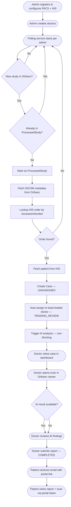

# Radiora — System Workflow

A chronological, step-by-step breakdown of every process in the system.

---

## Admin Setup

Before the system can process any scans, an admin must configure and activate integrations.

1. Admin registers an account: `POST /api/auth/register` with `role: ADMIN`.
2. Admin logs in: `POST /api/auth/login` → JWT returned + `radiora_token` cookie set.
3. Admin opens **Integration Config** in the admin dashboard.
4. Admin submits PACS config (Orthanc URL, credentials, poll interval):
   - `POST /api/integrations/pacs`
5. Admin submits HIS config (HIS URL, API key):
   - `POST /api/integrations/his`
6. Admin clicks "Activate" for each integration:
   - `POST /api/integrations/pacs/activate` → backend verifies Orthanc is reachable, saves `activatedAt`, **starts per-admin polling loop**
   - `POST /api/integrations/his/activate` → backend verifies HIS is reachable, saves `activatedAt`
7. Admin creates doctor accounts via `POST /api/admin/doctors`.
   - Auto-generates secure password, binds doctor to admin's org via `createdByAdminId`
   - Doctor doctors can only be created by the admin — self-registration as DOCTOR is not supported

> **Multi-tenancy note:** Each admin runs an independent polling loop for their own Orthanc. Doctor creation is admin-scoped. Data never leaks between organisations.

At this point the system is live and ready to receive studies.

---

## Auth Check (Frontend)

Whenever frontend needs to check if the user is logged in (e.g. navbar, route guard):

- `GET /api/auth/status` → returns `{ id, name, role, adminId, ... }`
- If `401` → redirect to login

Logout: `POST /api/auth/logout` → clears cookie, redirect to login.

---

## Patient & Order Creation

Performed by clinic staff or admin via HIS.

1. Register patient in HIS:
   - `POST /api/his/patients` → returns `patientId` (e.g. `P-1774469471231-D6XU`)
2. Create imaging order:
   - `POST /api/his/orders` with `patientId`, `modality`, `bodyPart`
   - HIS auto-generates and returns `accessionNumber` (e.g. `ACC-001`)
3. Technician scans the patient on the modality (CT/MRI).
4. Scan pushed to Orthanc via DICOM protocol. Orthanc stores it and assigns an internal `orthancId`.

> **Key requirement:** The DICOM file pushed to Orthanc MUST contain the `AccessionNumber` DICOM tag matching the HIS order. This is the only link between PACS and HIS.

> **Dev fallback:** If DICOM has no `AccessionNumber`, set `USE_FALLBACK_ACCESSION=true` + `FALLBACK_ACCESSION_NUMBER=ACC-...` in `.env` to use a hardcoded fallback for testing.

---

## Study Detection & Case Creation

The backend detects new studies and creates cases automatically — no manual intervention.

1. Per-admin polling loop fires every N seconds.
2. Poller calls `GET /studies` on this admin's Orthanc → list of `orthancId`s.
3. For each Orthanc study:
   - a. **Mark as `ProcessedStudy` FIRST** → prevents crash-retry loop on mid-poll restart
   - b. Call `GET /studies/:orthancId` → read DICOM metadata
     - Extract: `studyInstanceUID`, `AccessionNumber`, `PatientID`, `Modality`, `StudyDate`
   - c. Query HIS: `GET /orders?accessionNumber=...` → find matching order
     - If no match: **skip silently** (already marked processed; won't retry)
   - d. Query HIS: `GET /patients/:patientId` → get patient name, email, phone
   - e. Create `Case` in DB (status: `UNASSIGNED`, `aiStatus: NOT_REQUESTED`)
   - f. **Auto-assign** to least-loaded eligible doctor → status → `PENDING_REVIEW`
   - g. **Trigger AI analysis** (non-blocking, fire-and-forget):
     - POST to `{AI_BASE_URL}/analyze` with `{ caseId, studyInstanceUID, orthancUrl, callbackUrl }`
     - AI server fetches DICOM from the admin's `orthancUrl`, runs inference
     - When complete: POST `callbackUrl` → backend saves `AiResult`, updates `aiStatus: COMPLETED`
4. Admin/Doctor sees new case in dashboard on next load.

---

## Doctor Workflow

### Viewing Cases

Doctor logs in and views their inbox:
- `GET /api/cases` → returns **only cases assigned to this doctor** (backend-enforced, all statuses)
- Frontend can group by status: Active (`PENDING_REVIEW`, `IN_REVIEW`) vs. History (`COMPLETED`)

Admin views cases:
- Same endpoint `GET /api/cases` → returns **all cases for their org** (all statuses, all doctors)
- Admin can see who each case is assigned to and its current status

### Case Detail

Doctor or Admin opens a specific case:
- `GET /api/cases/:caseId` → full case including:
  - Patient info (name, email, phone)
  - DICOM metadata (modality, body part, study date)
  - `pacsViewerUrl` → direct link to Orthanc viewer for this study
  - `aiResult` block (if AI completed)
  - `report` block (if submitted)

### Doctor Opens Scan in Viewer

- Frontend uses `pacsViewerUrl` from case detail response
- Opens in new tab (or embeds via `<iframe>`) — no image data passes through backend
- Orthanc serves the DICOM viewer directly

### Manual Doctor Assignment (Admin only)

If auto-assignment didn't happen or admin wants to reassign:
- `POST /api/cases/:caseId/assign` with `{ doctorId }` → `PENDING_REVIEW`

---

## Report Submission

1. Doctor reviews scan and optionally the AI findings.
2. Doctor fills in report form in frontend and submits:
   - `POST /api/cases/:caseId/report` with `{ reportText, impression }`
3. Backend:
   - Creates `Report` record linked to case and doctor
   - Updates `Case.status` → `COMPLETED`
   - Generates unique `accessToken` (`radiora_rep_...`)
   - Sends patient email via SendGrid with portal link
   - Logs WhatsApp notification (simulated)
4. Case moves out of active inbox into completed history.

---

## Patient Access

1. Patient receives email with link: `https://radiora.app/portal/report/{token}`
2. Patient opens link — **no login required**
3. Frontend calls: `GET /api/portal/report/:token`
4. Backend validates token, returns:
   - Report text and impression
   - Patient name, modality, study date
   - `orthancBaseUrl` + `orthancId` + `studyInstanceUID`
5. Frontend renders the report and builds a viewer link:
   - `{orthancBaseUrl}/app/explorer.html#study?uuid={orthancId}` (Orthanc explorer)
   - Or uses `studyInstanceUID` with OHIF/Cornerstone for an embedded medical viewer

---

## System Flowchart

