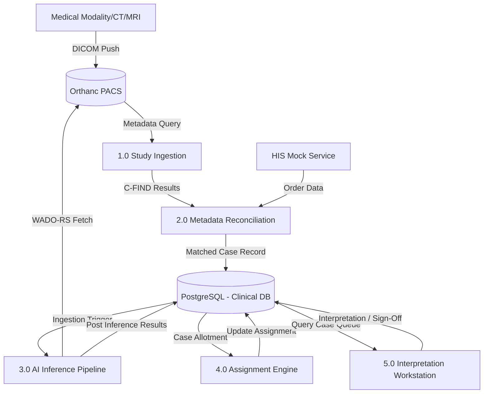
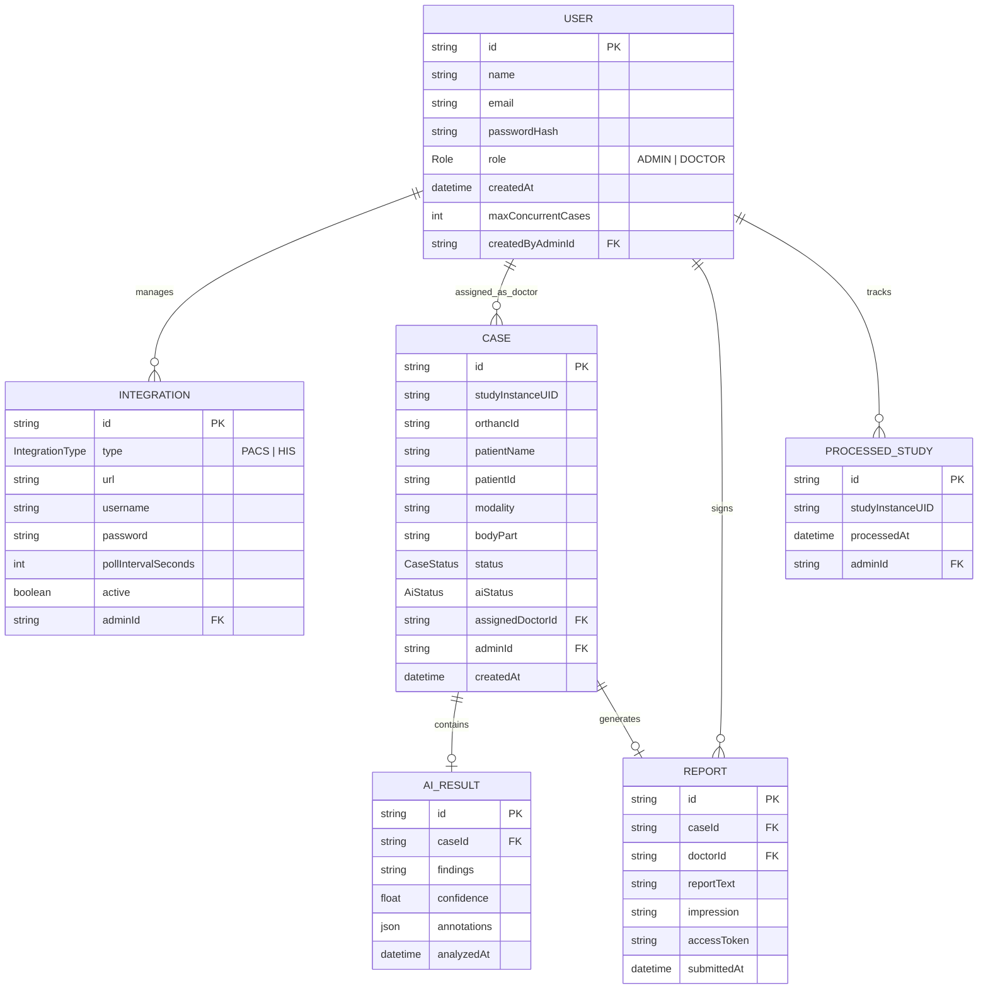
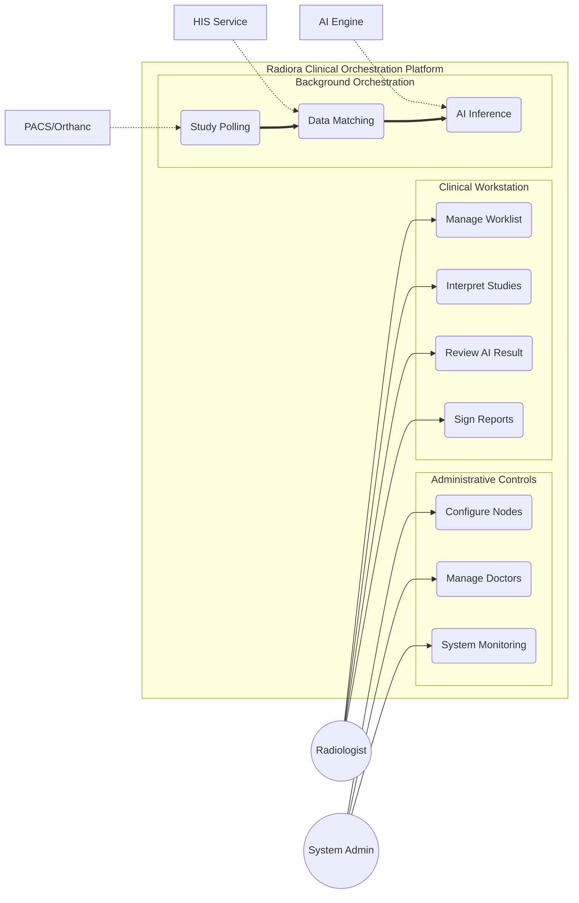
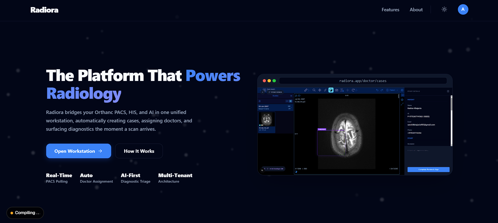
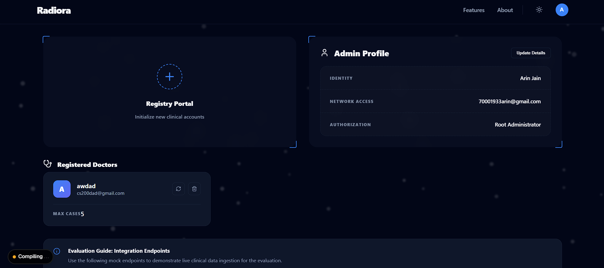
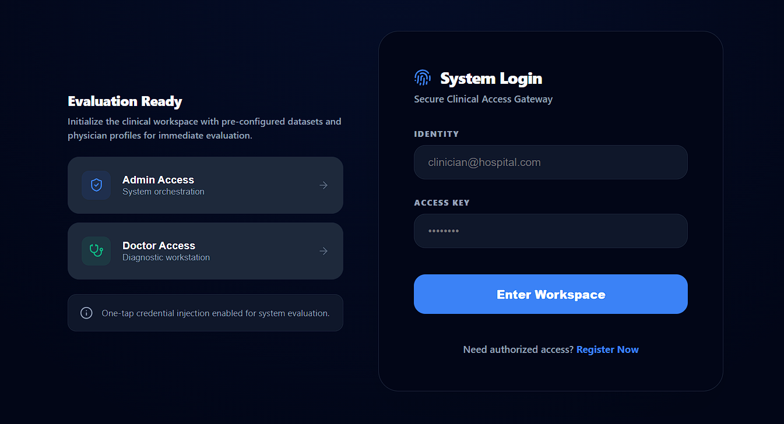
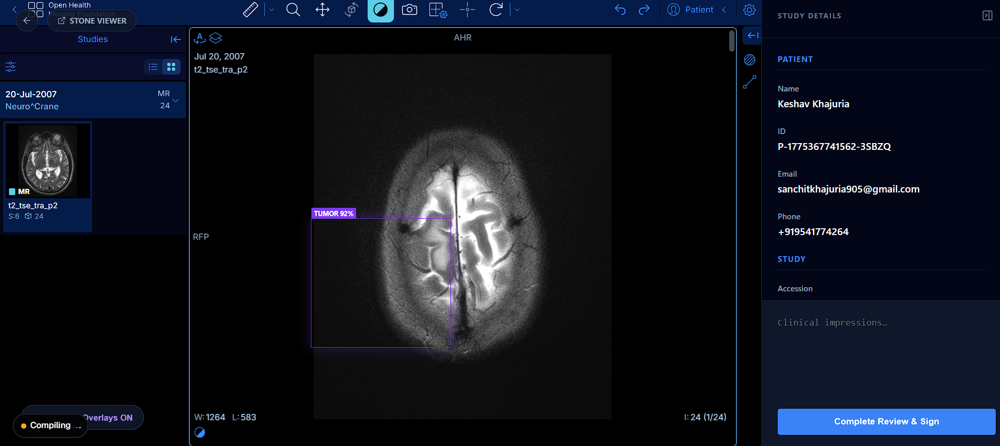

# Radiora — The Platform that Powers Radiology

> **Clinical Orchestration Engine v0.4.1**
> *Reclaiming Radiologist Focus through AI-First Automation*

---

## 1. Abstract
Radiora is a high-performance **Radiology Orchestration Platform** engineered to bridge the gap between medical imaging hardware (PACS/DICOM) and clinical interpretation. By automating the end-to-end workflow—from autonomous study ingestion to AI-driven triage and interpretation—Radiora eliminates the manual coordination friction that currently drives physician burnout. The platform acts as a mission-critical middle layer, unifying PACS servers, HIS orders, and AI inference into a single, high-precision clinical workstation.

---

## 2. Introduction
In the modern radiology department, interpreting physicians are overwhelmed by a fragmented technological landscape. Radiologists often spend up to 30% of their time on non-diagnostic tasks: manually matching studies to orders, searching for patient history, and toggling between disconnected AI tools and PACS viewers.

**Radiora** was built to solve this "Clinical Friction." Its core vision is **Orchestration**: a zero-touch pipeline where studies are automatically matched, triaged by AI, and assigned to the most specialized doctor the moment the scan is complete. By providing a unified HUD for admins and a dedicated diagnostic workstation for doctors, Radiora allows the clinical team to focus purely on what matters: the patient.

---

## 3. Technology Stack
The Radiora platform is built on a modern, high-concurrency stack designed for the data-intensive requirements of medical imaging:

- **Frontend**: Next.js 16 (App Router), React 19, TypeScript.
- **Backend API**: Node.js, Express, Prisma ORM.
- **Database**: PostgreSQL (Relational study-patient-user mapping).
- **Orchestration Layer**: Custom Node.js Polling Service (Orthanc REST API-based study polling & ingestion).
- **PACS Infrastructure**: Orthanc (DICOM Server) + Stone Web Viewer integration.
- **AI Inference**: Python/FastAPI (PyTorch & pydicom for DICOM analysis).
- **Security**: JWT-based Auth with Role-Based Access Control (RBAC).

---

## 4. Comparison with Existing Solutions

| Feature | Legacy Workflow | Radiora Orchestration |
| :--- | :--- | :--- |
| **Case Ingestion** | Manual study matching & triage | **Autonomous Polling & Ingestion** |
| **HIS Integration** | Disconnected; manual accession hunting | **1:1 HIS Parity Matching** |
| **AI Workflows** | Separate "islands" of AI results | **In-Workstation AI Triage** |
| **Doctor Assignment** | Bulk worklists; cherry-picking common | **Intelligent Load-Balanced Routing** |
| **Burnout Potential** | High (Administrative Overhead) | **Low (Diagnostic Focus)** |

---

## 5. Data Flow Diagram (DFD Level 1)
This diagram details the flow of clinical data through the orchestration engine.
> **Note**: Process labels are numbered (e.g., 1.0, 2.0) according to standard Gane-Sarson notation to indicate the sequence and hierarchy of operations.

---

## 6. Dataset / Database Description
Radiora utilizes a relational PostgreSQL database (managed via Prisma) to handle medical records and administrative metadata.

- **User**: System identities (Admins/Doctors) with specific `maxConcurrentCases` thresholds.
- **Case**: The immutable core study record containing `studyInstanceUID`, `accessionNumber`, and `modality` tags.
- **AiResult**: High-depth JSON annotations used for frontend SVG overlays and model confidence scores.
- **Report**: Interpretation textual data, impressions, and unique `accessToken` for report verification.
- **Integration**: Server configuration nodes (PACS/HIS) including credentials and polling frequency logic.

---

## 7. Entity-Relationship (E-R) Diagram
A production-grade E-R diagram representing the logical schema of the Radiora system with full attribute-level depth.

---

## 8. Use-Case Diagram
High-depth use-case mapping defining the interaction between primary actors and background clinical services.

---

## 9. Data Analysis and Visualization (AI Logic)
Radiora triggers a secondary **Python-based AI Inference Engine** for every ingested case.
- **Inference Strategy**: PyTorch models (Segmentation/Classification) run on high-resolution DICOM frames.
- **Metadata Analytics**: Analysis of study urgency based on presence of critical findings (e.g., massive hemorrhage).
- **Frontend Visualization**: Inference results (coordinates & labels) are rendered via **SVG Overlays** directly over the high-performance Stone Web Viewer.

---

## 10. Results (Prototype Snapshots)
The prototype demonstrates a premium, clinical-grade interface optimized for both speed and precision.

### 10.1 Platform Homepage
*The public entry point showing the "Powering Radiology" mission and architecture.*

### 10.2 Admin Control HUD
*50/50 Balanced header featuring the Registry Portal and Clinical Profile.*

### 10.3 High-Precision Login
*Secure, credentials-based access for interpreted doctors and admins.*

### 10.4 Clinical Workstation (Active Interpretation)
*Diagnostic environment with integrated Stone Web Viewer and AI finding overlays.*

---

## 11. Applications
- **Enterprise Radiology**: Manage multiple site configurations and doctor pools from a single dashboard.
- **AI Research Orchestration**: Rapidly deploy AI models into active clinical pipelines for diagnostic validation.
- **Burnout Mitigation Programs**: Standardizing workflow to reclaim physician bandwidth and improve diagnostic quality.

---

## 12. Conclusion & Future Scope
Radiora has successfully demonstrated the power of **Radiology Orchestration**. By eliminating manual friction, we have created a workstation that centers the doctor, not the task.

**Future Scope**:
- **Automated Impression Matching**: Using LLMs to synthesize AI findings into ready-to-sign draft reports.
- **Real-time Collaboration**: Secure doctor-to-doctor consults directly within the workstation.
- **Advanced Load Balancing**: Predictive case assignment based on historical interpretation speeds.

---

## References
- **DICOM Standard (PS3.x)** - National Electrical Manufacturers Association (NEMA).
- **Orthanc Project** - Open Source RESTful DICOM server (Jodogne, S. et al.).
- **Next.js & React 19 Documentation** - Vercel & Meta Resources.
- **Prisma & PostgreSQL** - Relational Data Management best practices.
